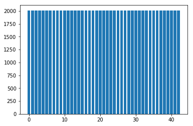

# **Traffic Sign Recognition** 

## Writeup

---

**Build a Traffic Sign Recognition Project**

The goals / steps of this project are the following:
* Load the data set (see below for links to the project data set)
* Explore, summarize and visualize the data set
* Design, train and test a model architecture
* Use the model to make predictions on new images
* Analyze the softmax probabilities of the new images
* Summarize the results with a written report

[//]: # (Image References)

[image1a]: ./writeup_img/vis_1_1.png "Visualization 1a"
[image1b]: ./writeup_img/vis_1_2.png "Visualization 1b"
[image1c]: ./writeup_img/vis_1_3.png "Visualization 1c"
[image2]: ./examples/grayscale.jpg "Grayscaling"
[image3]: ./examples/random_noise.jpg "Random Noise"
[image4]: ./examples/placeholder.png "Traffic Sign 1"
[image5]: ./examples/placeholder.png "Traffic Sign 2"
[image6]: ./examples/placeholder.png "Traffic Sign 3"
[image7]: ./examples/placeholder.png "Traffic Sign 4"
[image8]: ./examples/placeholder.png "Traffic Sign 5"

## Rubric Points
### Here I will consider the [rubric points](https://review.udacity.com/#!/rubrics/481/view) individually and describe how I addressed each point in my implementation.  

---
### Writeup / README

This is writeup part for the [code as hosted on github](https://github.com/sijmenw/udacity-project02-traffic-sign-classifier-project)

### Data Set Summary & Exploration

#### 1. Provide a basic summary of the data set. In the code, the analysis should be done using python, numpy and/or pandas methods rather than hardcoding results manually.

I used the pandas library to calculate summary statistics of the traffic
signs data set:

* The size of training set is 34799
* The size of the validation set is 4410
* The size of test set is 12630
* The shape of a traffic sign image is (32, 32)
* The number of unique classes/labels in the data set is 43

#### 2. Include an exploratory visualization of the dataset.

This section contains visualisation of the dataset, below are the 3 most
 occurring traffic signs by label in the dataset.

The image below shows the distribution of labels. On the Y-axis is the
amount of occurrences, on the X-axis the corresponding label.

The image below shows the distribution in the same manner, but after the
 augmentation of data (as described later in this writeup).

### Design and Test a Model Architecture

#### 1. Describe how you preprocessed the image data. What techniques were chosen and why did you choose these techniques? Consider including images showing the output of each preprocessing technique. Pre-processing refers to techniques such as converting to grayscale, normalization, etc. (OPTIONAL: As described in the "Stand Out Suggestions" part of the rubric, if you generated additional data for training, describe why you decided to generate additional data, how you generated the data, and provide example images of the additional data. Then describe the characteristics of the augmented training set like number of images in the set, number of images for each class, etc.)

The preprocessing consisted of two steps, firstly the image is
transformed with `cv2.cvtColor(img, cv2.COLOR_RGB2GRAY)` such that only
 one color channel remains.
Here is an example of a traffic sign image before and after.

Secondly I normalized the data so it's in range `[-1, 1]`.

I also performed data augmentation, mainly to make sure an equal number
of examples existed for every class. This is done to prevent bias from
having too much influence on the outcome. I have done the augmentation
by changing the intensity of a picture.

Below are two examples of pictures before and after augmentation.

This image turned out darker because of augmentation.

This image turned out slightly brighter because of augmentation.

#### 2. Describe what your final model architecture looks like including model type, layers, layer sizes, connectivity, etc.) Consider including a diagram and/or table describing the final model.

My final model consisted of the following layers:

| Layer         		|     Description	        					| 
|:---------------------:|:---------------------------------------------:| 
| Input         		| 32x32x1 single channel image   							|
| Convolution 5x5     	| 1x1 stride, valid padding, outputs 28x28x12 	|
| RELU					|												|
| Max pooling 2x2      	| 2x2 stride, valid padding, outputs 14x14x12   |
| Convolution 5x5	    | 1x1 stride, valid padding, outputs 10x10x24   |
| RELU					|												|
| Max pooling 2x2       | 2x2 stride, valid padding, outputs 5x5x24     |
| Flatten       		| units 600   									|
| Fully connected   	| units 120    									|
| RELU					| with dropout with rate 0.2    				|
| Fully connected   	| units 84    									|
| RELU					| with dropout with rate 0.2    				|
| Fully connected   	| units 43    									|
 

#### 3. Describe how you trained your model. The discussion can include the type of optimizer, the batch size, number of epochs and any hyperparameters such as learning rate.

To train the model I used a learning rate of 0.001. The loss operation
consisted of taking the mean of tf.nn.softmax_cross_entropy_with_logits.
I used the minimize function in AdamOptimizer to update the weights.

I used 10 epochs to train the model to have over 0.93 accuracy on the
validation set. The batch size used was 256.

#### 4. Describe the approach taken for finding a solution and getting the validation set accuracy to be at least 0.93. Include in the discussion the results on the training, validation and test sets and where in the code these were calculated. Your approach may have been an iterative process, in which case, outline the steps you took to get to the final solution and why you chose those steps. Perhaps your solution involved an already well known implementation or architecture. In this case, discuss why you think the architecture is suitable for the current problem.

My final model results were: # TODO
* training set accuracy of 0.99887927814
* validation set accuracy of 0.930
* test set accuracy of 0.919002375325

If an iterative approach was chosen:
I used the LeNet's network architecture as proposed in earlier videos
and adapted as necessary.

I added dropout layers to help prevent overfitting.

It also seemed the original network could not
perform as well with more complicated images and more possible classes.
To solve this, I added more filters to the earlier layers, which
increased the validation accuracy above the threshold of 0.93.

### Test a Model on New Images

#### 1. Choose five German traffic signs found on the web and provide them in the report. For each image, discuss what quality or qualities might be difficult to classify.

Here are five German traffic signs that I found on the web (after
resizing):

#### 2. Discuss the model's predictions on these new traffic signs and compare the results to predicting on the test set. At a minimum, discuss what the predictions were, the accuracy on these new predictions, and compare the accuracy to the accuracy on the test set (OPTIONAL: Discuss the results in more detail as described in the "Stand Out Suggestions" part of the rubric).

Here are the results of the prediction:

| Image			        |     Prediction	        					| 
|:---------------------:|:---------------------------------------------:| 
| Dangerous curve to the left |	Dangerous curve to the left  			|
| Slippery road    			| Slippery road 							|
| Pedestrian	    		| Keep right								|
| Wild animals crossing		| Wild animals crossing		 				|
| Ahead only		        | Ahead only    							|

The model was able to correctly guess 4 of the 5 traffic signs, which gives an accuracy of 80%.
On the original test set the accuracy was higher (91.9%).

#### 3. Describe how certain the model is when predicting on each of the five new images by looking at the softmax probabilities for each prediction. Provide the top 5 softmax probabilities for each image along with the sign type of each probability.

The code for making predictions on my final model is located at the top
of the "Analyze performance" section in the iPython notebook.

For each of the 5 images holds: if it was right, the p value was very
high. For each of the correct predictions, the rounded value for p was
given as 1.0 indicating it was very close to 1.

For image of class: 19 (Dangerous curve to the left)

| Class         	|     Probability	        					|
|:---------------------:|:---------------------------------------------:|
|19    |1.0|
|21    |6.719255794124246e-12|
|11    |7.103853596234398e-20|
|23    |4.029633638070553e-25|
|30    |7.135118697826953e-26|

For image of class: 23 (Slippery road)

| Class         	|     Probability	        					|
|:---------------------:|:---------------------------------------------:|
|23    |1.0|
|11    |6.044421629880503e-10|
|30    |3.134690770845161e-11|
|19    |1.5430214970465561e-15|
|31    |3.4186177162853636e-23|

For image of class: 27 (Pedestrian)

| Class         	|     Probability	        					|
|:---------------------:|:---------------------------------------------:|
|38    |0.8782812356948853|
|18    |0.12171877920627594|
|31    |1.6604208242718133e-12|
|26    |7.233724795378815e-13|
|0     |5.653059400798077e-13|

For image of class: 31 (Wild animals crossing)

| Class         	|     Probability	        					|
|:---------------------:|:---------------------------------------------:|
|31    |1.0|
|25    |6.478035989576636e-12|
|11    |1.244769173868499e-19|
|21    |5.883482857703232e-21|
|30    |2.7595596920556716e-24|

For image of class: 35 (Ahead only)

| Class         	|     Probability	        					|
|:---------------------:|:---------------------------------------------:|
| 35    | 1.0 |
| 36    | 2.8007957064701827e-11 |
| 9     | 2.8306892420337793e-14 |
| 34    | 2.707535903107277e-14 |
| 13    | 1.4230612605729658e-14 |
